# IntelliReview - AI Code Review Assistant 

## What is this project?
Hi! This is my project called **IntelliReview**. It is a web app that helps students and developers check their code. You can paste your code in C++, Java, Python, or JavaScript, and the Artificial Intelligence (AI) will tell you if there are any bugs and how to improve it.

It's like having a teacher available 24/7 to check your coding homework!

## Features
- **Multi-Language Support**: Works with C++, Java, Python, and JS.
- **Smart AI**: Uses a really fast AI (Groq) to give feedback instantly.
- **Cool Design**: Has a dark mode editor and a clean review section.
- **Easy Explanations**: The AI explains things simply so you can learn.

---

## 🏗️ Architecture Diagram
Here is how the system works:

```mermaid
graph TD
    A[👤 User] -->|Writes Code| B[🖥️ Frontend<br/>React + Vite]
    B -->|Sends Code via HTTP| C[⚙️ Backend<br/>Spring Boot]
    C -->|Requests Review| D[🤖 Groq AI API]
    D -->|Returns Feedback| C
    C -->|Sends Review| B
    B -->|Shows Result| A
    
    style A fill:#4f46e5,stroke:#312e81,stroke-width:2px,color:#fff
    style B fill:#06b6d4,stroke:#0e7490,stroke-width:2px,color:#fff
    style C fill:#10b981,stroke:#047857,stroke-width:2px,color:#fff
    style D fill:#f59e0b,stroke:#b45309,stroke-width:2px,color:#fff
```


1.  **Frontend**: The website part you see (built with React).
2.  **Backend**: The brain of the server (built with Java Spring Boot).
3.  **Groq API**: The AI service that actually analyzes the text.

---

## 🚀 How to Run the Project

Follow these steps to run the app on your computer.

### Step 1: Backend Setup (The Server)
1.  Open the `backend` folder.
2.  Open the `.env` file and make sure your API Key is there:
    ```
    GROK_API_KEY=your_key_here
    ```
3.  Open a terminal in the `backend` folder and run:
    ```bash
    mvn spring-boot:run
    ```
4.  Wait until it says "Started CodeReviewApplication".

### Step 2: Frontend Setup (The Website)
1.  Open a new terminal.
2.  Go to the `frontend` folder:
    ```bash
    cd frontend
    ```
3.  Install the dependencies (first time only):
    ```bash
    npm install
    ```
4.  Start the website:
    ```bash
    npm run dev
    ```
5.  Open the link shown (usually `http://localhost:5173`) in your browser.

---

## Technologies Used
- **Frontend**: React, Tailwind CSS (for styling), Monaco Editor (for the code box).
- **Backend**: Java, Spring Boot.
- **Tools**: Docker (for putting it on the cloud), Git (for saving code).

